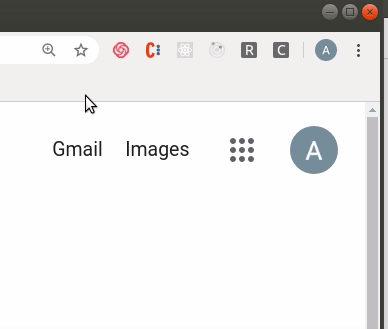

# Covtension

A simple chrome extension built in HTML, CSS and JS that allows users to search for live coronavirus data on any country.

## Video demo



## Getting Started

**To get started:**

- git clone the repo

```
git clone this repo and open the directory
```

- Install all the required packages with

```
npm install
```

- Build from webpack

```
npm run build
```

To install in Edge/ Chrome

- Head over to edge://extensions or chrome://extensions
- Toggle "Developer mode" on.
- Click Load unpacked.
- Upload the dist folder to Edge
- The extension should now be available for use
